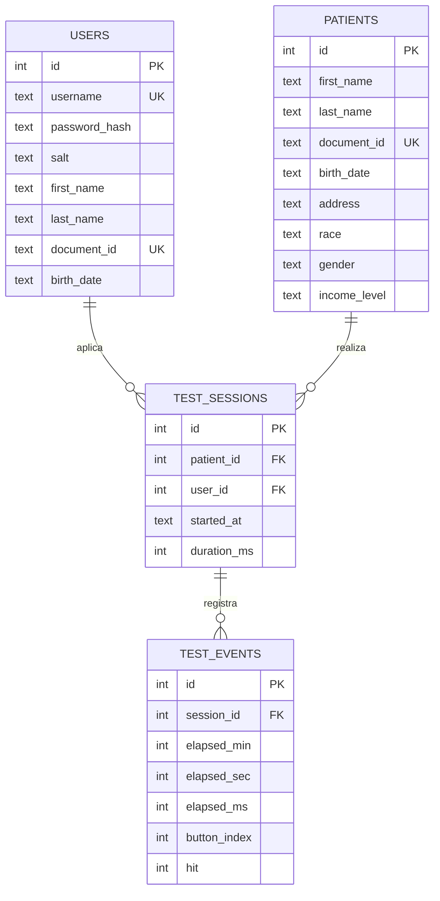
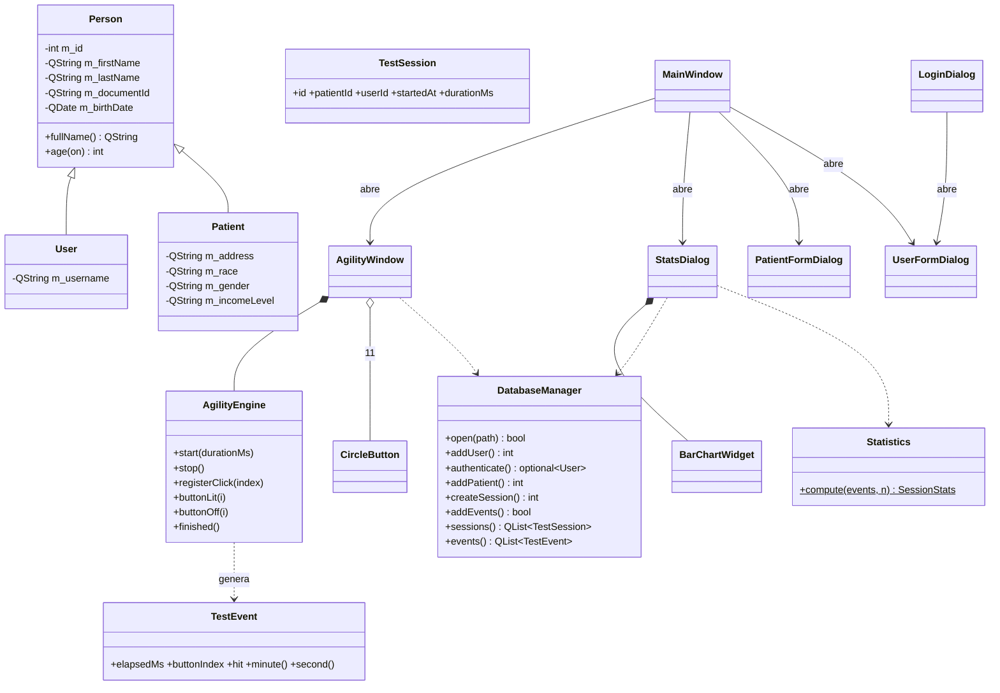
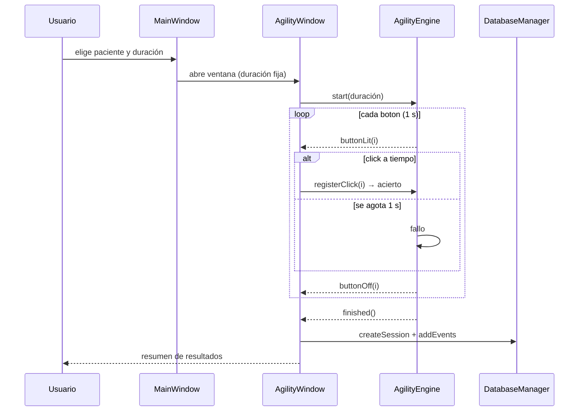

# Modelos de diseño (para el informe)

## Diagrama entidad–relación (SQLite)

```mermaid
erDiagram
    USERS ||--o{ TEST_SESSIONS : "aplica"
    PATIENTS ||--o{ TEST_SESSIONS : "realiza"
    TEST_SESSIONS ||--o{ TEST_EVENTS : "registra"

    USERS {
        int id PK
        text username UK
        text password_hash
        text salt
        text first_name
        text last_name
        text document_id UK
        text birth_date
    }
    PATIENTS {
        int id PK
        text first_name
        text last_name
        text document_id UK
        text birth_date
        text address
        text race
        text gender
        text income_level
    }
    TEST_SESSIONS {
        int id PK
        int patient_id FK
        int user_id FK
        text started_at
        int duration_ms
    }
    TEST_EVENTS {
        int id PK
        int session_id FK
        int elapsed_min
        int elapsed_sec
        int elapsed_ms
        int button_index
        int hit
    }
```

## Diagrama de clases (UML)

```mermaid
classDiagram
    class Person {
        -int m_id
        -QString m_firstName
        -QString m_lastName
        -QString m_documentId
        -QDate m_birthDate
        +fullName() QString
        +age(on) int
    }
    class User { -QString m_username }
    class Patient {
        -QString m_address
        -QString m_race
        -QString m_gender
        -QString m_incomeLevel
    }
    Person <|-- User
    Person <|-- Patient

    class TestEvent { +elapsedMs +buttonIndex +hit +minute() +second() }
    class TestSession { +id +patientId +userId +startedAt +durationMs }

    class DatabaseManager {
        +open(path) bool
        +addUser() int
        +authenticate() optional~User~
        +addPatient() int
        +createSession() int
        +addEvents() bool
        +sessions() QList~TestSession~
        +events() QList~TestEvent~
    }
    class AgilityEngine {
        +start(durationMs)
        +stop()
        +registerClick(index)
        +buttonLit(i)
        +buttonOff(i)
        +finished()
    }
    class Statistics { +compute(events, n)$ SessionStats }

    class MainWindow
    class AgilityWindow
    class StatsDialog
    class LoginDialog
    class UserFormDialog
    class PatientFormDialog
    class CircleButton
    class BarChartWidget

    MainWindow --> AgilityWindow : abre
    MainWindow --> StatsDialog : abre
    MainWindow --> PatientFormDialog : abre
    MainWindow --> UserFormDialog : abre
    LoginDialog --> UserFormDialog : abre
    AgilityWindow *-- AgilityEngine
    AgilityWindow o-- CircleButton : 11
    StatsDialog *-- BarChartWidget
    AgilityWindow ..> DatabaseManager
    StatsDialog ..> DatabaseManager
    StatsDialog ..> Statistics
    AgilityEngine ..> TestEvent : genera
```

## Flujo de la prueba

```mermaid
sequenceDiagram
    participant U as Usuario
    participant M as MainWindow
    participant W as AgilityWindow
    participant E as AgilityEngine
    participant D as DatabaseManager
    U->>M: elige paciente y duración
    M->>W: abre ventana (duración fija)
    W->>E: start(duración)
    loop cada boton (1 s)
        E-->>W: buttonLit(i)
        alt click a tiempo
            W->>E: registerClick(i) → acierto
        else se agota 1 s
            E->>E: fallo
        end
        E-->>W: buttonOff(i)
    end
    E-->>W: finished()
    W->>D: createSession + addEvents
    W-->>U: resumen de resultados
```
